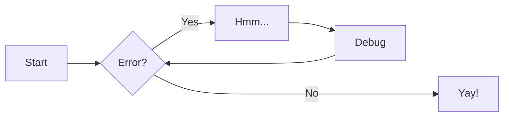
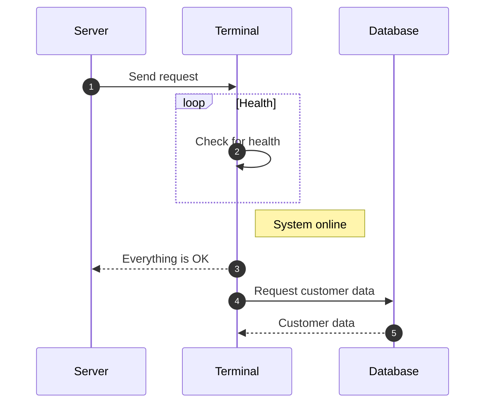

# Document Files

Welcome to the research highlights section. Below are the key papers and materials.

## Paper 1: Understanding the Universe

[Download Paper 1 (PDF)](split.pdf)


Here’s a brief description of the paper's key findings.

## Material 1: Educational Material

You can download the educational material from the link below:

[Download Material 1](example.txt)

## Simulator File

For those interested in the simulator, here is the Python script for the first simulator:

[Download Simulator Script](example.py)

## JPG File

Here is the IPG file for the simulation:

[Download IPG File](jpg.avif)

## EPS File

Here is the IPG file for the simulation:

[Download IPG File](eps.avif)

## PNG File

Here is the IPG file for the simulation:

[Download IPG File](png.avif)

Here is the IPG file for the simulation:

[Download IPG File](svg.avif)


# Welcome to the Presentation

---

# Slide 1: Introduction

Welcome to this presentation about **MkDocs** and **Presentations**.

---

# Slide 2: Why Use MkDocs for Presentations?

- Simple setup
- Markdown-based
- Supports themes like Material

---

# Slide 3: Adding Images

You can add images just like in regular Markdown:


---

# Slide 4: Conclusion

Thank you for attending the presentation!


# My Table

Here is a simple table that displays data:

| Name        | Age | Occupation  |
|-------------|-----|-------------|
| Cristiano Ronaldo    | 39  | Developer   |
| Leonel Messi  | 37  | Designer    |
| Kylian Mbappe | 24  | Manager     |
| Luka Modric | 32 | Tester |


## PowerPoint Presentation

<iframe src="/mkdocs.pdf" width="100%" height="600px"></iframe>


An example of a codeblock for python: 

```py title="add_numbers.py" linenums="1"
# Function to add two numbers 
def add_two_numbers(num1, num2):
    return num1 + num2 

# Example usage 
result = add_two_numbers(5, 3)
print('The sum is:', result)
```

Example codeblock for javascript with line highlighted:

```js title="concatenate_strings.js" linenums="1" hl_lines="8"
// Function to concatenate two strings 
function concatenateStrings(str1, str2) {
    return str1 + str2;
}

// Example usage
const result = concatenateStrings("Hello, ", "World!");
console.log("The concatenated string is:", result);
```

### Genertic Content

=== "Plain Text"

    This is some plaint text

=== "Unordered List"

    * First item
    * Second item
    * Third item

=== "Ordered List"

    1. First item
    2. Second item
    3. Third item

### code blocks in content tabs 

=== "Python"

    ```py
    def main ():
        print("Hello World!")

    if __name__ == "__main__":
        main()
    ```

=== "JavaScript"

    ```js
    function main() {
        console.log("Hello World!");
    }

    main ();
    ```

Example of an admonition/callout with a title:

!!! note "Note"

    Lorem ipsum dolor sit amet, consectetur
    adipiscing elit, Nulla at euismod 
    nulla, curabitur feugiat, tortor non 
    consequat finibus, justo purus auctor 
    massa, nec semper lorem quam in massa.

!!! Abstract "Abstract"

    Lorem ipsum dolor sit amet, consectetur
    adipiscing elit, Nulla at euismod 
    nulla, curabitur feugiat, tortor non 
    consequat finibus, justo purus auctor 
    massa, nec semper lorem quam in massa.

??? info "Collapsible callout"

    Lorem ipsum dolor sit amet, consectetur
    adipiscing elit, Nulla at euismod 
    nulla, curabitur feugiat, tortor non 
    consequat finibus, justo purus auctor 
    massa, nec semper lorem quam in massa.

!!! tip "Tip"

    Lorem ipsum dolor sit amet, consectetur
    adipiscing elit, Nulla at euismod 
    nulla, curabitur feugiat, tortor non 
    consequat finibus, justo purus auctor 
    massa, nec semper lorem quam in massa.

!!! success "Success"

    Lorem ipsum dolor sit amet, consectetur
    adipiscing elit, Nulla at euismod 
    nulla, curabitur feugiat, tortor non 
    consequat finibus, justo purus auctor 
    massa, nec semper lorem quam in massa.

!!! Question "question"

    Lorem ipsum dolor sit amet, consectetur
    adipiscing elit, Nulla at euismod 
    nulla, curabitur feugiat, tortor non 
    consequat finibus, justo purus auctor 
    massa, nec semper lorem quam in massa.

!!! warning "Warning"

    Lorem ipsum dolor sit amet, consectetur
    adipiscing elit, Nulla at euismod 
    nulla, curabitur feugiat, tortor non 
    consequat finibus, justo purus auctor 
    massa, nec semper lorem quam in massa.

!!! failure "Failure"

    Lorem ipsum dolor sit amet, consectetur
    adipiscing elit, Nulla at euismod 
    nulla, curabitur feugiat, tortor non 
    consequat finibus, justo purus auctor 
    massa, nec semper lorem quam in massa.

!!! danger "Danger"

    Lorem ipsum dolor sit amet, consectetur
    adipiscing elit, Nulla at euismod 
    nulla, curabitur feugiat, tortor non 
    consequat finibus, justo purus auctor 
    massa, nec semper lorem quam in massa.

!!! bug "Bug"

    Lorem ipsum dolor sit amet, consectetur
    adipiscing elit, Nulla at euismod 
    nulla, curabitur feugiat, tortor non 
    consequat finibus, justo purus auctor 
    massa, nec semper lorem quam in massa.

!!! example "Example"

    Lorem ipsum dolor sit amet, consectetur
    adipiscing elit, Nulla at euismod 
    nulla, curabitur feugiat, tortor non 
    consequat finibus, justo purus auctor 
    massa, nec semper lorem quam in massa.

!!! quote "Quote"

    Lorem ipsum dolor sit amet, consectetur
    adipiscing elit, Nulla at euismod 
    nulla, curabitur feugiat, tortor non 
    consequat finibus, justo purus auctor 
    massa, nec semper lorem quam in massa.


# Diagram Example 

## Flowcharts 



## Sequence Diagram 


